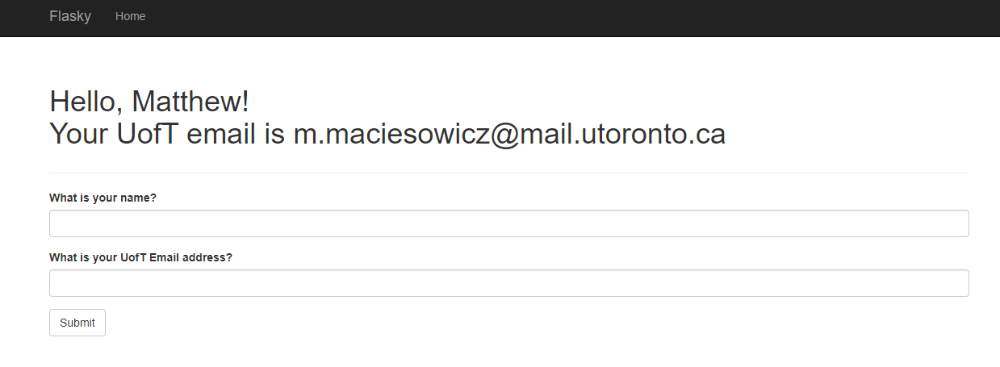
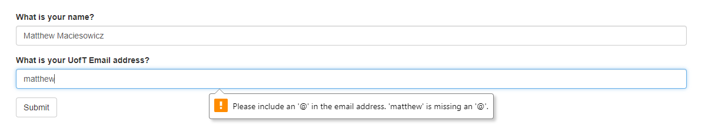
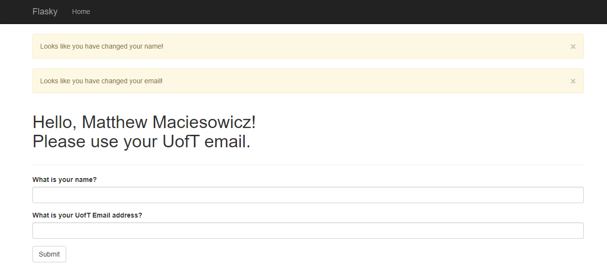

# E444-F2024-PRA2

 Matthew Maciesowicz
 
 Flask Web Development Example
This repo is a clone of https://github.com/miguelgrinberg/flasky.

## Screenshots

### Activity 1.4: part 3

### Activity 1.4: part 4

### Activity 1.4: part 5
